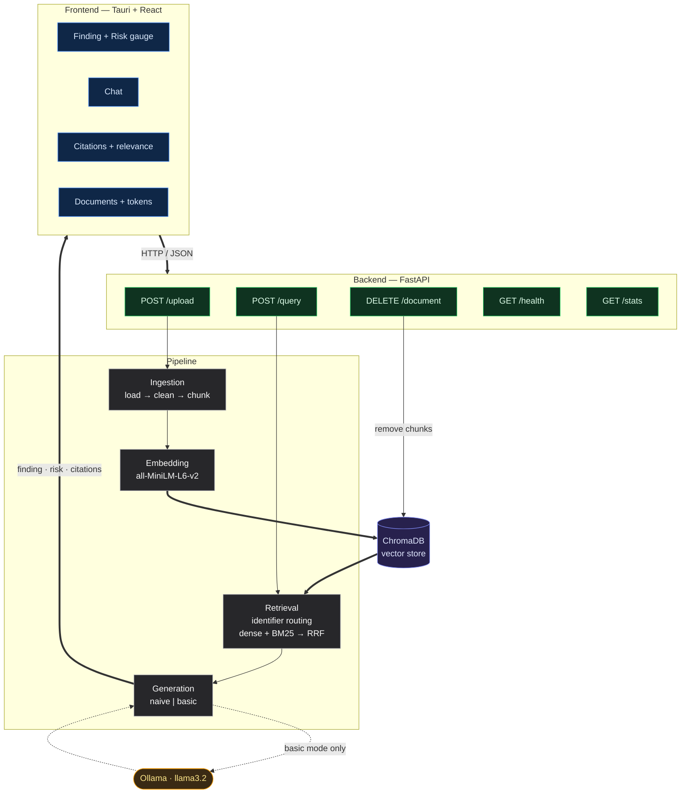

A desktop application that uses **Retrieval-Augmented Generation (RAG)** to analyze
enterprise documents with dense cross-referencing, answer questions about them, as well as flag  **fraud risk** with a confidence-scored, source-cited breakdown for human review.
Built with a **Python / FastAPI** backend (ChromaDB + local embeddings + a local
Llama 3.2 model via Ollama) and a **Tauri + React + TypeScript** frontend.

---

## What it looks like

### Fraud detected — high-risk invoice (dark theme)
A suspicious payment request is scored **80 / HIGH**, with the contributing risk
factors broken down and the exact source passage cited.


### Clean document — low risk (light theme)
A normal reference document (configuration-management notes) is correctly scored
**0 / LOW** — the model does not invent risk where there is none.


---

## Features

- **Document ingestion** — upload `.pdf`, `.docx`, or `.txt`; text is extracted
  (footnotes and running headers stripped from PDFs), cleaned — spacing repair for
  badly-encoded files, removal of symbol-font glyphs that survive extraction as
  unreadable boxes — split on structural markers, embedded, and stored alongside
  the page, article, chapter or clause it came from.
- **Hybrid retrieval** — dense semantic search and **BM25** lexical scoring are run
  over the corpus and their two rankings are combined by **Reciprocal Rank Fusion
  (RRF, k = 60)**. Fusing on rank rather than score sidesteps the problem that
  cosine similarity and BM25 term weights are not on comparable scales, so a query
  is matched on meaning *and* on exact terminology.
- **Identifier routing** — a query naming a specific location ("what does clause 148
  say?") skips similarity search entirely and resolves by exact metadata lookup;
  hybrid search is the fallback when no identifier is present. Where several
  identifiers appear, the most specific wins.
- **Attention-aware context ordering** — retrieved passages are not handed to the
  model in rank order. Attention over a long context is strongest at its start and
  end, so the ranking is interleaved outward: the two strongest passages sit at
  both ends and the weakest are buried in the middle, where they cost least.
- **Adjustable retrieval depth** — the number of passages sent to the model is
  selectable per query, capped at 12 — the point beyond which the prompt outgrows
  the model's 4096-token context window and the tail is silently dropped.
- **Two generation modes**
  - **Naive** — retrieval only; returns the ranked passages with no LLM call.
  - **Basic** — retrieval **+** Llama 3.2 generation; produces a synthesised answer
    *and* a structured fraud-risk assessment.
- **Structured fraud risk** — every basic-mode answer returns a risk **level**,
  a **score (0–100)**, and a list of weighted **risk factors**, visualised as a
  gauge and a factor breakdown.
- **Confidence scoring** — each answer carries a 0–100 confidence combining the
  strongest and mean relevance of its supporting passages, halved when the
  generated text contains language indicating the model declined to answer.
  Banded as high (≥ 70), probable (≥ 40) and low.
- **Document scoping** — click a loaded document to scope all queries to it, so
  results never bleed across files.
- **Source citations + structural provenance** — see exactly which passages the
  answer was grounded in, how relevant each was, and which page, article or clause
  of which document it came from.
- **Live token + hardware dashboard** — real prompt/response token usage pulled from
  Ollama against the model's context window, plus live CPU / GPU / VRAM readings and
  whether the model is currently resident in memory.
- **Replayable conversation** — every answered turn stores its finding, citations,
  retrieval scores, risk and token usage. Clicking a turn in the transcript
  restores that state into the panes, so the chat acts as an index into past
  evidence rather than a second copy of the latest answer.
- **Resizable panes** — the finding and citation views share a draggable divider,
  as do the three main columns.
- **Light & dark themes.**

---

## Architecture


## Tech stack

| Layer | Tech |
|-------|------|
| Frontend | Tauri, React 19, TypeScript, Vite, Tailwind, Recharts |
| Backend | FastAPI, Uvicorn, Pydantic |
| Embeddings | sentence-transformers (`all-MiniLM-L6-v2`, pinned to CPU) |
| Retrieval | ChromaDB dense search + `rank-bm25` (Okapi BM25), fused with RRF |
| Vector store | ChromaDB (local, persistent) |
| LLM | Ollama running `llama3.2` (local) |
| Ingestion | PyMuPDF, python-docx, wordninja |
| Telemetry | psutil, pynvml |

---

## Getting started

### Prerequisites
- Python 3.12+
- Node.js 18+
- [Ollama](https://ollama.com) installed locally
- An NVIDIA GPU is optional but strongly recommended. `llama3.2` needs roughly
  3.5 GB of VRAM including its KV cache at a 4096-token context; on a 4 GB card
  expect partial CPU offload and correspondingly slower generation.

### 1. Backend

```bash
cd backend
python -m venv venv
source venv/bin/activate
pip install -r requirements.txt
```

### 2. Ollama (local LLM)

```bash
ollama pull llama3.2     # downloads the model
ollama serve             # starts the server on localhost:11434
```

> If you keep models in a custom folder, set `OLLAMA_MODELS` to that path
> **before** running `ollama serve`, otherwise it may start with zero models.

### 3. Run the backend

```bash
cd backend
uvicorn api:app --reload
```

API docs (Swagger): http://localhost:8000/docs

### 4. Frontend

```bash
cd frontend
npm install
npm run dev          # web dev server (http://localhost:1420)
# or, for the desktop app:
npm run tauri dev
```

---

## Usage

1. **Upload a document** — drag a file onto the *Drop file or click to add* zone
   in the right-hand panel, or click to browse. It's chunked and indexed; the newly
   uploaded document becomes the **active** document automatically.
2. **Scope your query** — the active document (blue outline, "active" badge) is the
   only one searched. Click another document to switch scope.
3. **Pick a mode** — `naive` (retrieval only, no LLM call) or `basic` (retrieval +
   LLM + fraud risk). Use **basic** for fraud assessment.
4. **Ask a question** — type into the chat box and press Enter.
5. **Read the results**
   - **Finding** — the synthesised answer, plus the **risk gauge** and **factor
     breakdown** (basic mode).
   - **Retrieved Citations** — the exact source passages and their relevance.
   - **Context Window** — real token usage for the request.

### Tip — trigger a fraud assessment
Upload a document with red flags (e.g. an invoice with urgency, changed bank
details, missing approvals) and ask:
> *"Assess the fraud risk in this document and list the specific red flags."*

---

## Known limitations

- **`.docx` tables are dropped.** Extraction iterates paragraphs only; table
  content lives in a separate collection and is silently skipped.
- **No OCR path.** A scanned, image-only PDF ingests "successfully" with zero
  chunks rather than failing loudly.
- **The BM25 index is rebuilt on every query.** Tokenising the corpus and
  constructing the index per request is linear in corpus size — negligible at a
  few hundred chunks, prohibitive at tens of thousands.
- **Confidence thresholds are unvalidated.** The weighting, the abstention penalty
  and the band boundaries were set by inspection, not calibrated against a
  labelled set.
- **Ingestion is synchronous.** A large upload blocks the request worker until
  chunking and embedding finish.
- **CORS is fully open** — correct for local development, not for deployment.

---

## Roadmap

The current build is a working end-to-end vertical slice. Planned next, per the
project's research goals:

- [x] **Hybrid retrieval** — dense + BM25, fused with RRF
- [x] **Structural provenance** — answers cite the page / article / clause they came from
- [x] **Confidence scoring** — implemented as a heuristic over retrieval relevance and
      abstention detection; thresholds are not yet calibrated against a labelled set
- [ ] **Cross-reference resolution** — follow references *inside* retrieved passages
      ("as defined in Article 6") and pull the target provision into context
- [ ] **Linguistic anomaly detection** for vague / obscuring language
- [ ] **Self-reflective hallucination mitigation** (answer-vs-source verification)
- [ ] **Cross-document signal aggregation**
- [ ] **Evaluation harness** (naive vs basic, retrieval & groundedness metrics)

---

## Project

Academic project — Computer Science, IFE (2026).
Repository: https://github.com/JayAlvn/Fraud-Detection-RAG-Pipeline
